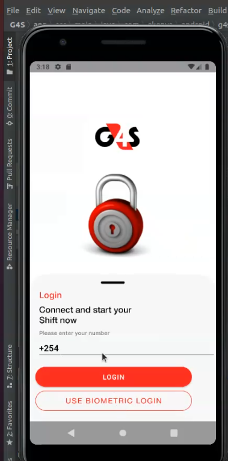
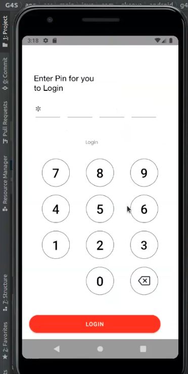

### Author
Waruguru Muriithi

### ABout the App
This is an access control app to be used by the common soldiers at the entrances of buildings to checkin visitors and check them out as well.

### Demo

### Requirements;
Android studio
Git
CLI
ANdroid buid tools 28+
Android phone 7.0 and up

