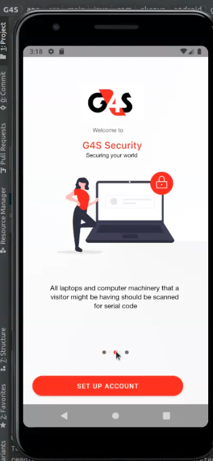

### Author
Waruguru Muriithi

### ABout the App
This is an access control app to be used by the common soldiers at the entrances of buildings to checkin visitors and check them out as well.

# This Kotlin example app teaches the very basics of how to work with Contentful for Android:

  consume content from the Contentful Delivery and Preview APIs
  model content
  edit content through the Contentful web app
  The app demonstrates how decoupling content from its presentation enables greater flexibility and facilitates shipping higher quality software more quickly.

### Demo

### Requirements;
Android studio
Git
CLI
ANdroid buid tools 28+
Android phone 7.0 and up

